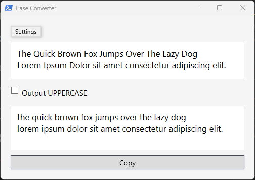

# Case Converter

A modern PowerShell GUI for converting text between lowercase and uppercase, built with WPF. Supports multi-line input/output, easy copy button, and theme adaptation (light/dark). Theme defaults to system, but can be manually set in the settings menu.

## Features

- Convert text between UPPERCASE and lowercase
- Multi-line input and output
- Copy output to clipboard with one click
- Light/Dark theme adapts to Windows system or manual selection
- Simple, modern WPF interface

## Screenshot

## Installation

1. Download or clone this repository.
2. Ensure you are running Windows 10/11 with PowerShell 5.1+.
3. No external dependencies required.

## Usage

1. Right-click `caseConverter.ps1` and select "Run with PowerShell".
2. Enter your text in the input box.
3. Select "Output UPPERCASE" to convert to uppercase, or leave unchecked for lowercase.
4. Click "Copy" to copy the result to your clipboard.
5. Use the Settings menu to switch between Light and Dark themes.

## Requirements

- Windows 10/11
- PowerShell 5.1 or later

## Contributing

Contributions are welcome! Please fork the repository and submit a merge request.

## Authors

- CKSAPP (built with GitHub Copilot AI agent GPT-4.1 model)
